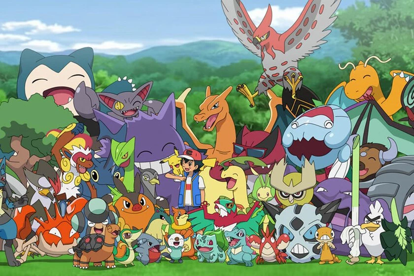

# Análisis 

<p align="center">
    
</p>

### **WWEPoke Battle Ring**

El **WWEPoke Battle Ring** es un concepto revolucionario que convierte las batallas Pokemon tradicionales en una experiencia mucho más envolvente y apasionante, inspirada en el universo del entretenimiento deportivo, en particular la lucha libre profesional (como WWE).  Mediante la agrupación de Pokemon a través del algoritmo K-Means, nos basamos en un **índice de ataque calculado de manera estadística**, y así se estableció un sistema de clasificación que facilita la división de los Pokemon en distintos estilos de combate, los cuales son:  agresivo, defensivos y balanceado.

Esta categorización no solo brinda un nuevo enfoque distinto para comprender las fortalezas de los Pokemon, sino que también **abre la puerta a una narrativa enriquecedora y comercializable**, donde cada clase de Pokemon simboliza una versión con historia, estética y estilo distintivos.  El desenlace es un entorno de lucha con ligas temáticas, avance competitivo, luchas inolvidables y la oportunidad de realizar eventos especiales que mantengan a la comunidad involucrada y asombrada.

---

### Clusterización aplicada a la narrativa y jugabilidad

Utilizando el siguiente índice:

```
Índice de ataque = (Attack + Sp. Atk) - (Defense + Sp. Def)
```

Decidimos agrupar los Pokemon de la siguiente manera, existen 6 clústeres distintos: 3 para Pokemon comunes y 3 para legendarios. Estos clústeres representan no solo un tipo de estadísticas, sino también **un estilo de combate y personalidad**, lo que nos permite usarlos como base para las siguientes facciones:

| Cluster | Descripción                     | Facción WWE                                                                            |
| ------- | ------------------------------- | -------------------------------------------------------------------------------------- |
| 0       | Balanceado (índice ≈ 0)        | *Team Harmony*: Técnicos y versátiles, dominan el arte del equilibrio.          |
| 1       | Agresivo (índice muy positivo)  | *Team Berserkers*: Atacantes natos, veloces y destructivos. Son los reyes del KO.      |
| 2       | Defensivo (índice negativo)     | *Team Aegis*: fortaleza pura. Soportan ataques como muros inquebrantables.         |
| 3-5     | Igual que 0-2, pero legendarios | *Legendary Deluxe*: Una categoría especial de élite con sus propias reglas y desafíos. |

Esta división genera una diversidad en cuanto a **estéticas visuales, tácticas de juego y arcos narrativos** para cada conjunto, facilitando que los jugadores se identifiquen con su estilo favorito y fomentando una experiencia de competencia mela y diferente.

---

### Mecánicas del sistema WWE

#### Facciones como identidad de combate

Cada grupo origina una **facción con personalidad distintiva**, lo que facilita no solo diferencias estratégicas en la batalla, sino también un vínculo emocional con el jugador.  La belleza de estas facciones puede manifestarse en animaciones de inicio del juego, música relacionada, colores característicos e incluso gestos únicos:

* **Team Berserkers**: Luchadores de combate directo. Imagina a Charizard, Infernape o Garchomp ingresando al ring acompañado de música vibrante y luces rojas. Sus agresiones provocan miedo en el estadio.

* **Team Guardians**: Pokemon majestuosos como Snorlax, Aggron o Toxapex. Sus intros son fuertes, con efectos de piso que se desmorona y una música intensa y pausada.

* **Team Versus**: Técnicos, precavidos, centrados y flexibles.  Este grupo incluye a Pokemon como Lucario, Gallade o Flygon.  Su introducción exhibe su versatilidad y exactitud con animaciones de estilo ninja o artista de arte marcial.

* **Legendary League**: Este conjunto representa la analogía de las superestrellas de la WWE. Cada uno posee un "título" único y combate en escenarios lujosos, con actuaciones épicas repletas de pirotecnia, intros cinematográficas y comentarios que resaltan su pasado y poder.

#### Sistema de ligas y progresión

El sistema WWE puede ser aplicado como un **estilo de combate alternativo por temporadas**, en el que el jugador se enfrente dentro de su propia facción, escala de rango y se involucra en eventos de temática específica.  Algunas propuestas comprenden:

* Torneos clasificatorios internos por facción.
* Combates interfacción con restricciones de estilo.
* Clasificación por puntos en función de desempeño, estilo y sinergia.

Además, tenemos pensado establecer una **liga "Deluxe" de legendarios**, en donde se enfrentan solo los clústeres legendarios, elevando la categoría del torneo a un nivel épico que puede cerrar cada temporada como si fuera un “Wrestlemania Pokemon”.

#### Recompensas y desbloqueables

Conforme los jugadores progresan, pueden adquirir premios visuales y cosméticos exclusivos dependiendo de su equipo:

* Skins con armaduras para los Aegis 
* Espectros de poder y rapidez para los Berserkers 
* Cintas o capas técnicas para los Harmony
* Anillos legendarios de energía para la Liga Legendary 
---

## Eventos Especiales

Uno de los beneficios más innovadores del clustering es que facilita la creación de **eventos temáticos inspirados en los estilos de los Pokemon**.  Estos acontecimientos están diseñados para prevenir que el juego se vuelva monótono, promover la búsqueda de nuevas tácticas y **otorgarle un protagonismo temporal a cada clúster**.

### Algunos eventos especiales

| Evento                    | Descripción                                                                                                                                                                                  |
| ------------------------- | -------------------------------------------------------------------------------------------------------------------------------------------------------------------------------------------- |
| **Semana de los Tanques** | Solo participan Pokemon del clúster defensivo. Las batallas se alargan y se premia la resistencia. Ideal para jugadores pacientes y estratégicos.                                            |
| **Versus Royale**         | Combates con Pokemon equilibrados. Los equipos deben usar mínimo un Pokemon del clúster versátil. Se valora la toma de decisiones táctica.                                                   |
| **Berserker Blitz**       | Combates rápidos, con límite de turnos, protagonizados por Pokemon ofensivos. Los combates son breves pero intensos. Ideal para torneos exprés.                                              |
| **Leyendas Eternas**      | Combate exclusivo entre Pokemon legendarios. Aquí los jugadores enfrentan a las leyendas más poderosas del universo Pokemon. Es un modo premium, ideal para contenido cinematográfico o PvE. |                                               |
| **Clash of Styles**       | Equipos obligatoriamente formados por un Pokemon de cada clúster. Se premia la sinergia y creatividad. Promueve la diversidad de equipos.                                                    |

---


