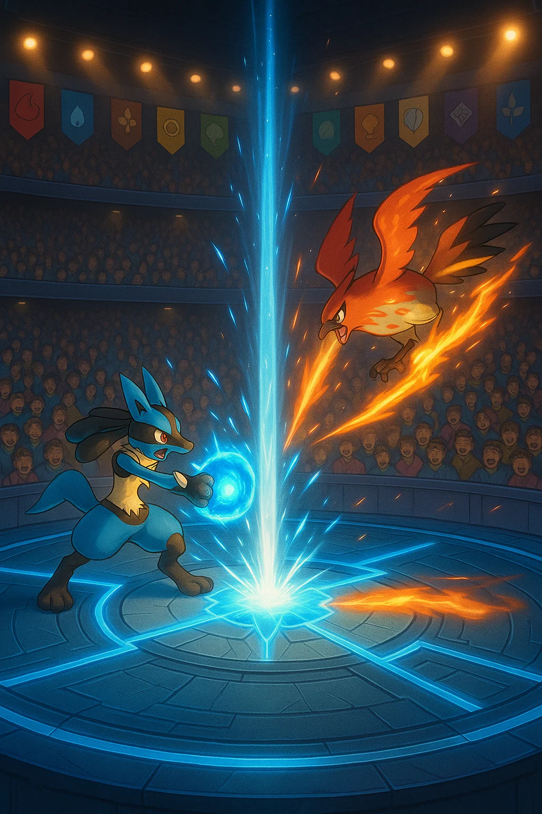
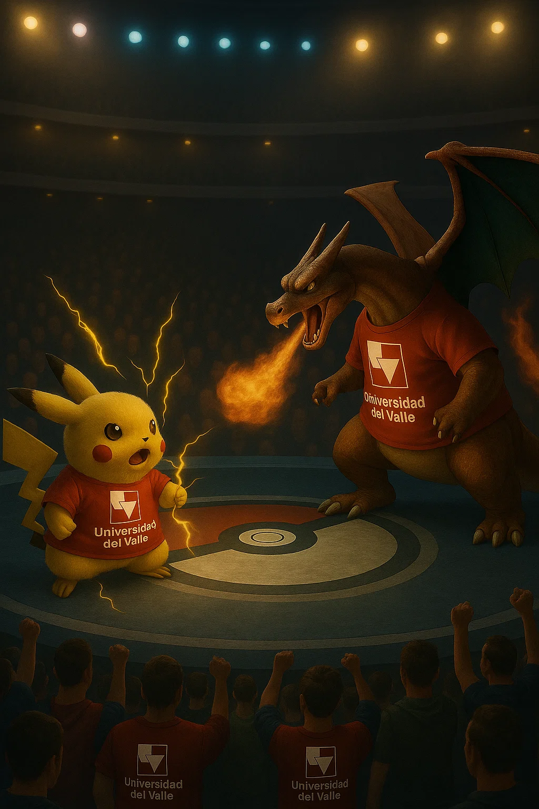
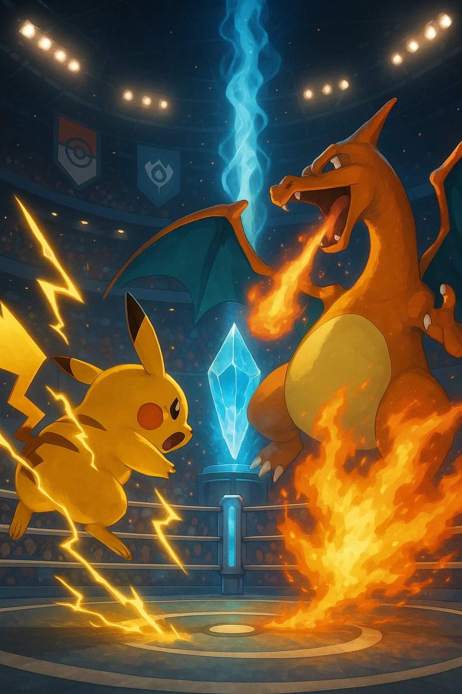

### Análisis de Mercado - Propuesta para Pokemon Company 

  
  
  

#### Modo de combate WWE online

Implementar este sistema como **un modo de batalla especial** en futuros juegos principales (como *Pokémon Scarlet/Violet 2* o sus sucesores), o incluso como una extensión independiente en plataformas existentes como *Pokémon Showdown* o una nueva aplicación móvil.

* **Nombre tentativo**: *Pokémon WWE League Mode*
* **Características clave**:

  * Combates clasificados por facciones (ofensiva, defensiva, equilibrada).
  * Progresión en ligas estilo competitivo (Bronce → Plata → Oro → Campeón).
  * Temporadas temáticas con eventos especiales.
  * Clústeres como restricciones para construir equipos balanceados.

#### App móvil “PokéLeague Battle Pass”

Una aplicación independiente que permita a los jugadores formar equipos, enfrentarse en ligas temáticas, ganar medallas WWE y personalizar sus Pokémon con elementos visuales exclusivos (cinturones, bandas, máscaras). Esta app puede monetizarse con micropagos estéticos, recompensas desbloqueables y torneos online patrocinados.

---

### Mercancía: Productos físicos basados en clústeres

Los clústeres definidos por el sistema WWE representan diferentes **identidades de combate**. Esto abre una oportunidad para desarrollar una línea de mercancía tematizada, basada en los tres estilos principales y sus versiones legendarias.

#### 🔹 1. Figuras de acción y coleccionables

* **Línea de figuras “WWE PokéFighters”**:

  * *Berserker Blaziken*: postura de combate, efectos de fuego y músculos marcados.
  * *Tank Snorlax*: figura pesada con armadura WWE estilo “sumo”.
  * *Versatile Lucario*: figura articulada con doble estilo (puede adoptar forma ofensiva o defensiva).
  * *Ring de PokePelea*: ring de pelea estilo WWE personalizado con tematica de gymnasio pokemon
  * Edición limitada *Legendary Deluxe*: figuras con luces LED, sonidos personalizados y empaque temático.

#### 🔹 2. Stickers, posters y tarjetas por facción

* Stickers coleccionables con logotipos de cada clúster.
* Posters de cada facción con su roster de Pokémon.
* Tarjetas con diseño tipo *ring de combate*, donde cada Pokémon tiene atributos WWE (fuerza, defensa, estilo, finisher move, etc.).

#### 🔹 3. Decks temáticos para JCC Pokémon (Juego de Cartas Coleccionables)

* *Deck WWE: Golpe Crítico* → Pokémon ofensivos con cartas de daño rápido.
* *Deck WWE: Defensa Total* → Pokémon defensivos con cartas de bloqueo y resistencia.
* *Deck WWE: Estrategia Técnica* → Pokémon equilibrados con cartas de manipulación y adaptabilidad.
* Cada deck incluiría un “campeón” especial y cartas de ataque personalizadas estilo WWE.

---

### Material Multimedia

#### Miniserie animada: *Pokémon: Ultimate Ring Battles*

Una serie animada tipo torneo mundial que dramatiza los combates entre facciones WWE de Pokémon. Inspirada en animes de deportes y lucha libre, con enfoque narrativo y estilo de presentación tipo *WWE SmackDown*.

* **Formato**: 10 episodios por temporada (8 combates + 2 especiales (Centrados en los cameos y lore con luchadores reales)).
* **Narrador tipo WWE**: frases épicas, dramatización de combates, comentarios técnicos y cómicos.
* **Estilo visual**: arenas iluminadas, presentaciones por equipo, movimientos especiales coreografiados.
* **Narrativa**: Rivalidades entre clústeres, traiciones, alianzas, redención de Pokémon subestimados.

#### Eventos interactivos para la comunidad

La comunidad de fans podría participar activamente en eventos organizados por Pokémon Company:

* **Votaciones en línea**:

  * ¿Qué facción es tu favorita?
  * ¿Cuál fue el mejor combate del torneo?
  * ¿Qué Pokémon debería ser el próximo campeón de la WWE League?

* **Creador de equipos WWE**:

  * Página web o app para construir tu equipo ideal según reglas WWE.
  * Comparte tus equipos y vota por el más popular.
  * Rankings semanales y recompensas digitales.

* **Retos creativos**:

  * Diseñar posters o intros de tu Pokémon WWE favorito.
  * Crear la biografía de combate de tu equipo (estilo wrestler profile).
  * Los mejores diseños podrían convertirse en productos oficiales o material canónico de eventos.

* **Colaboraciones**:
  * Cameos de luchadores reales en el videojuego y la serie como entrenadores pokemon. 
  * Merchandaising de las mismas colaboraciones.
---